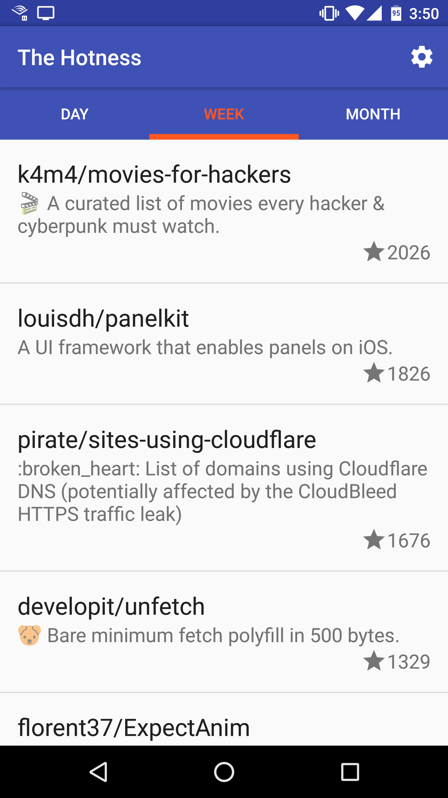

# Github Hotness

> Stay up to date with the repos all the cool kids are starring.

  

## Overview

Github Hotness, aka The Hotness, shows you the trending new repos on Github. It
shows you repos that have been created in the last 24 hours, week, or month,
that have been starred by the most users.

It is very similar to the [Github Explore](https://github.com/explore) daily
email, except that the email shows repos that have received the most stars,
whereas The Hotness shows only the repos that have received the most stars
**and** that have been created in the time window.

## Why?

This was the model for the project in an [Android
course](https://courses.cs.washington.edu/courses/cse390a1/16au/) I taught in
the autumn of 2016 at the University of Washington. It is relatively simple
while still doing interesting things, like using the network and persisting
things to disk.

It also uses a number of popular libraries, like
[Retrofit](https://square.github.io/retrofit/), [Dagger
2](https://google.github.io/dagger/),
[Butterknife](https://jakewharton.github.io/butterknife/), and
[RxJava](https://github.com/ReactiveX/RxJava).

